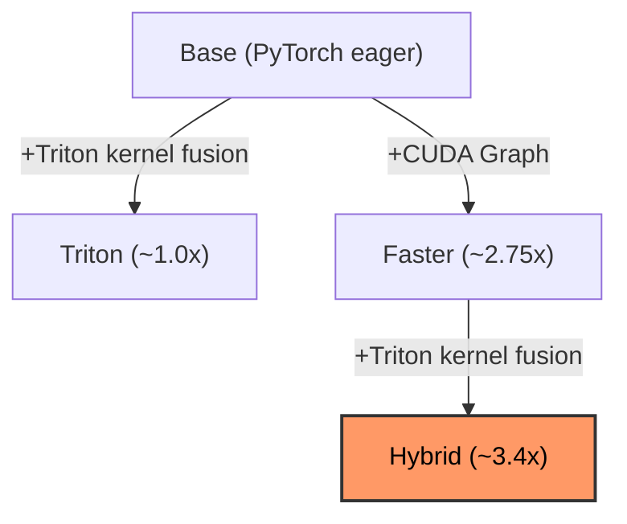

# omnivoice-triton

[](https://github.com/newgrit1004/omnivoice-triton/actions/workflows/ci.yml)
[](https://pypi.org/project/omnivoice-triton/)
[](https://pypi.org/project/omnivoice-triton/)
[](https://opensource.org/licenses/Apache-2.0)

**Up to 3.4x faster OmniVoice inference through Triton kernel fusion and CUDA Graph optimization.**

[Korean (한국어)](README_ko.md) | [Benchmark Results](docs/benchmark_results_en.md)

> [!NOTE]
> This project has only been tested on **RTX 5090 (Blackwell, sm_120)** with **WSL2** (CUDA 12.8, PyTorch 2.8).
> Triton kernels are architecture-agnostic (no sm_120-specific code), so they should work on other NVIDIA GPUs (A100, H100, RTX 4090, etc.), but this has **not been verified**. If you test on a different GPU, please open an issue or PR with your results!

---

OmniVoice-Triton replaces performance-critical operators in [OmniVoice](https://github.com/k2-fsa/OmniVoice) with hand-written [Triton](https://github.com/triton-lang/triton) kernels. Inspired by [Liger Kernel](https://github.com/linkedin/Liger-Kernel) (LinkedIn), each kernel fuses multiple HBM round-trips into a single pass, reducing memory traffic without any additional VRAM usage.

OmniVoice uses a **Non-Autoregressive (NAR) iterative unmasking** architecture: 32 forward passes through the full 28-layer Qwen3-0.6B backbone generate the entire token sequence in parallel. Unlike autoregressive TTS where the sequence grows token by token, OmniVoice fixes the sequence length (determined by the duration predictor) and progressively refines all positions simultaneously. This makes it **deterministic with a fixed seed** — the same input always produces the same output.

This NAR structure creates two optimization opportunities absent in standard AR models:

1. **CUDA Graph**: Since sequence length is fixed across all 32 unmasking steps, every forward pass has the **same tensor shape**. CUDA Graph captures the entire 28-layer forward pass once and replays it — eliminating ~900 kernel launch overheads per utterance.

2. **Triton Kernel Fusion**: The Qwen3-0.6B backbone uses RMSNorm and SwiGLU activations. These are memory-bandwidth-bound on modern GPUs; fusing them reduces HBM round-trips from 4→1 (RMSNorm) and eliminates intermediate tensors (SwiGLU).

The **Hybrid** mode — Triton kernels applied before CUDA Graph capture — achieves **3.4x end-to-end speedup** with only ~50MB additional VRAM.

### 💡 Why Triton?

- 🪶 **Lightweight & Portable** — No serving infrastructure needed. Just `pip install omnivoice-triton` and call `create_runner("hybrid")`. Works in standalone scripts, Gradio apps, or any Python environment.
- 🎯 **Deterministic NAR TTS** — OmniVoice is approximately deterministic at temperature=0. With Hybrid mode's **~3.4x speedup**, you can generate speech in under 170ms for typical utterances — making real-time interactive TTS practical.

### ✨ Highlights

- ⚡ **3 Fused Triton Kernels** — RMSNorm, SwiGLU, Fused Norm+Residual
- 🎯 **6 Inference Modes** — Base, Triton, Triton+Sage, Faster, Hybrid, Hybrid+Sage
- 🔬 **3-Tier Verification** — Kernel correctness → Model parity → E2E quality
- 💾 **~50MB Extra VRAM** — Pure kernel fusion, no model changes
- 🔌 **Drop-in Patching** — Single `create_runner()` call with mode selection
- 📊 **Streamlit Dashboard** — Side-by-side comparison UI with live metrics
- 🗣️ **3 Voice Modes** — Auto TTS, Voice Cloning, Voice Design

## 📦 Install

**Requirements**: Python 3.12+, CUDA 12.8+, NVIDIA GPU (~2GB VRAM). Tested on WSL2 (Windows Subsystem for Linux 2).

### From PyPI

```bash
# 1. Install PyTorch with CUDA support first
pip install torch torchaudio --index-url https://download.pytorch.org/whl/cu128

# 2. Install omnivoice-triton
pip install omnivoice-triton
```

### From Source (development)

```bash
# Install UV (if not installed)
curl -LsSf https://astral.sh/uv/install.sh | sh

# Clone and setup
git clone https://github.com/newgrit1004/omnivoice-triton.git
cd omnivoice-triton
make setup  # uv sync --all-extras --dev + pre-commit install + git config
```

> **UV handles virtual environments automatically** — no need to manually activate a venv.
> All commands use the `uv run` prefix (e.g., `uv run pytest`, `uv run python script.py`).
> PyTorch is installed from the [cu128 index](https://download.pytorch.org/whl/cu128) automatically via `pyproject.toml`.

#### Dependency Groups

```bash
uv sync                 # Core (triton, omnivoice, sageattention, streamlit, plotly)
uv sync --extra eval    # + Quality evaluation tools
uv sync --extra dev     # + Dev tools (ruff, pytest, pre-commit)
uv sync --extra all     # Everything
```

## 🚀 Quick Start

> [!TIP]
> On first run, the OmniVoice model (~2GB) is automatically downloaded from HuggingFace.

### Triton Mode

```python
from omnivoice_triton import create_runner
import soundfile as sf

runner = create_runner("triton")
runner.load_model()

result = runner.generate(
    text="Hello, this is optimized with Triton kernels.",
)

# Save audio
sf.write("output.wav", result["audio"], result["sample_rate"])
print(f"Generated in {result['time_ms']:.1f}ms, VRAM: {result['peak_vram_gb']:.2f}GB")

runner.unload_model()
```

### Hybrid Mode (Triton + CUDA Graph, ~3.4x faster)

```python
from omnivoice_triton import create_runner
import soundfile as sf

runner = create_runner("hybrid")
runner.load_model()  # Triton patches applied before CUDA Graph capture

result = runner.generate(
    text="Hybrid mode: CUDA Graph + Triton fusion.",
)

sf.write("output.wav", result["audio"], result["sample_rate"])
runner.unload_model()
```

### 📊 Streamlit Dashboard

```bash
make ui  # http://localhost:8501
```

The dashboard provides:
- 🔄 Side-by-side inference comparison across all modes
- 📈 Live metrics (Generation Time, RTF, Peak VRAM)
- 📉 Plotly charts for visual comparison
- ✅ 3-Tier verification result cards

## 🎧 Audio Samples

Pre-generated samples comparing all inference modes.

| Mode | Directory |
|------|-----------|
| Base (PyTorch) | [`assets/audio_samples/base/`](assets/audio_samples/base/) |
| Triton | [`assets/audio_samples/triton/`](assets/audio_samples/triton/) |
| Triton+Sage | [`assets/audio_samples/triton_sage/`](assets/audio_samples/triton_sage/) |
| Faster (CUDA Graph) | [`assets/audio_samples/faster/`](assets/audio_samples/faster/) |
| Hybrid (Faster+Triton) | [`assets/audio_samples/hybrid/`](assets/audio_samples/hybrid/) |
| Hybrid+Sage | [`assets/audio_samples/hybrid_sage/`](assets/audio_samples/hybrid_sage/) |

Each directory contains samples in Korean, English, and Chinese, as well as voice cloning and voice design samples.

> Use `make ui` → **Audio Samples** tab for side-by-side playback and comparison.
> Regenerate: `make generate-samples` (GPU required).

## ⚡ Triton Kernels

All kernels target the **OmniVoice LLM backbone** (Qwen3-0.6B, 28-layer Transformer, hidden_size=1024, intermediate=3072).

| Kernel | What It Fuses | HBM Savings | File |
|--------|--------------|-------------|------|
| **RMSNorm** | variance + normalize + scale in SRAM | 4→1 round-trips | `kernels/rms_norm.py` |
| **SwiGLU** | `silu(gate) * up` — eliminates intermediate tensor | 3→1 round-trips | `kernels/swiglu.py` |
| **Fused Norm+Residual** | `residual + x` then RMSNorm in one kernel | 2 kernels → 1 | `kernels/fused_norm_residual.py` |

### 🔌 How Patching Works

`apply_triton_kernels()` performs in-place monkey-patching:

1. **RMSNorm modules** → replaced with `TritonRMSNorm` (shares original weights, zero copy)
2. **MLP forward** → patched to use `triton_swiglu_forward` (fused gate+up projection)
3. **Decoder layer forward** → patched for fused residual addition + normalization

```python
from omnivoice_triton.models.patching import apply_triton_kernels

# Patches all 28 decoder layers in-place (patch counts logged via logging)
apply_triton_kernels(model)
```

<details>
<summary><b>Advanced: Manual Patching</b></summary>

If you want to apply Triton kernels to a model loaded outside the Runner API:

```python
from omnivoice import OmniVoice
from omnivoice_triton.models.patching import apply_triton_kernels
import torch

model = OmniVoice.from_pretrained(
    "k2-fsa/OmniVoice",
    device_map="cuda:0",
    dtype=torch.bfloat16,
)

# Patch the internal LLM backbone
apply_triton_kernels(model.llm)
```

For Hybrid mode with manual patching, Triton kernels must be applied before CUDA Graph capture:

```python
from omnivoice_triton.models.patching import apply_triton_kernels

# Apply Triton patches first
apply_triton_kernels(model.llm)

# Then capture CUDA Graph
model.capture_cuda_graph()
```

</details>

## 🔬 3-Tier Verification

Inspired by [Liger Kernel](https://github.com/linkedin/Liger-Kernel) and adapted for deterministic NAR TTS.

| Tier | What | Threshold | Time | Command |
|------|------|-----------|------|---------|
| **1. Kernel** | Per-kernel numerical correctness (atol/rtol) | bf16: 0.05, fp16: 1e-3 | ~5s | `make test` (60 tests) |
| **2. Model** | Layer-by-layer cosine similarity | > 0.95 at layers 0,7,14,21,27 | ~15s | `make test-parity` |
| **3. E2E** | Deterministic pair comparison (temperature=0) | Exact match within tolerance | ~5min | `make smoke-test` |

### Tier 1 Thresholds

| dtype | atol | rtol |
|-------|------|------|
| float32 | 1e-5 | 1e-5 |
| float16 | 1e-3 | 1e-3 |
| bfloat16 | 5e-2 | 5e-2 |

### Tier 2: Latest Results

OmniVoice is approximately deterministic at temperature=0 — the same input produces the same output, making direct pair-wise comparison valid at Tier 2.

✅ **Tier 1**: 60/60 PASS

✅ **Tier 2**: All layers > 0.95 cosine similarity

| Layer | Cosine Sim |
|-------|-----------|
| L0 | > 0.999 |
| L7 | > 0.999 |
| L14 | > 0.998 |
| L21 | > 0.997 |
| L27 | > 0.995 |

> FP accumulation naturally decreases similarity across 28 layers — this is expected behavior for fused kernels that change operation order.

### Running Verification

```bash
make test          # Tier 1: 60 kernel tests
make test-parity   # Tier 2: Model parity (GPU required)
make verify        # Tier 1 + 2
make smoke-test    # Tier 3: Fast E2E check
```

## 📊 Benchmarks

<!-- BENCH:SUMMARY:START -->
> **Hybrid (Faster+Triton)** achieves **3.4x** faster inference than PyTorch baseline at equivalent VRAM on RTX 5090.
<!-- BENCH:SUMMARY:END -->

### 🏗️ Optimization Modes



```bash
make bench-kernels  # Per-kernel micro-benchmarks (PyTorch vs Triton)
make bench-speed    # End-to-end inference (all runners, 3 languages)
make bench          # Both
```

<details>
<summary><b>Hardware & Methodology</b></summary>

| Item | Spec |
|------|------|
| GPU | NVIDIA RTX 5090 (Blackwell, sm_120, 32GB) |
| CUDA | 12.8 |
| PyTorch | 2.8 (cu128) |
| Triton | bundled with PyTorch 2.8 |
| Model | OmniVoice (Qwen3-0.6B backbone, 28 layers) |
| OS | WSL2 (Linux 5.15) |
| Python | 3.12 |
| Dtype | bfloat16 |
| Batch Size | 1 |

**Kernel benchmarks**: `triton.testing.do_bench()`, batch=1, seq_len=512, hidden=1024.
**E2E benchmarks**: `torch.cuda.Event` timing, 3 warmup + 5 measured runs per text.
RTF (Real-Time Factor) = audio_duration / generation_time. RTF > 1 means faster-than-real-time.

</details>

### ⚡ Kernel Micro-Benchmarks

<!-- BENCH:KERNEL:START -->
> RTX 5090, bf16, batch=1, seq_len=512, hidden=1024. Run `make bench-kernels` to reproduce.

| Kernel | PyTorch (ms) | Triton (ms) | Speedup | HBM Savings |
|--------|:------------:|:-----------:|:-------:|:-----------:|
| RMSNorm | 0.02665 | **0.00452** | **5.90x** | 4→1 trips |
| SwiGLU | 0.00996 | **0.00696** | **1.43x** | 3→1 trips |
| Fused Norm+Residual | 0.02875 | **0.00643** | **4.47x** | 2→1 kernels |
<!-- BENCH:KERNEL:END -->

### 🏎️ E2E Inference

<!-- BENCH:E2E:START -->
> RTX 5090, bf16, 3 texts (ko + en + zh), 3 warmup + 5 runs each. Run `make bench-speed` to reproduce.

| Mode | Latency (ko) | Latency (en) | Latency (zh) | Avg Speedup | Peak VRAM |
|------|:------------:|:------------:|:------------:|:-----------:|:---------:|
| Base (PyTorch) | 556 ms | 781 ms | 573 ms | 1.0x | 1.95 GB |
| Triton | 519 ms | 512 ms | 506 ms | 1.02x | 1.95 GB |
| Faster | 193 ms | 227 ms | 188 ms | 2.75x | 1.98 GB |
| **Hybrid (Faster+Triton)** | **165 ms** | **179 ms** | **164 ms** | **3.26x** | 2.00 GB |
<!-- BENCH:E2E:END -->

### 📡 RTF Analysis

| Mode | RTF (Korean) | RTF (English) | RTF (Chinese) | Avg RTF |
|------|:-----------:|:------------:|:------------:|:-------:|
| Base | 4.74x | 4.56x | 3.53x | 4.28x |
| Triton | 5.01x | 6.51x | 3.95x | 5.16x |
| Faster | 14.58x | 15.99x | 11.70x | 14.09x |
| **Hybrid** | **16.63x** | **20.44x** | **13.81x** | **16.96x** |

Hybrid mode generates audio at roughly 17x real-time on average — a 3.26x improvement over the PyTorch baseline.

> **Disclaimer**: Benchmarks measured on a single RTX 5090. Results vary with GPU model, driver version, system load, and input text length. Run `make bench` on your hardware for accurate numbers.

## 📁 Project Structure

```
omnivoice-triton/
├── src/
│   └── omnivoice_triton/            # PyPI package
│       ├── __init__.py               # Public API + __version__
│       ├── py.typed                  # PEP 561 type marker
│       ├── kernels/                  # Triton GPU kernels
│       │   ├── rms_norm.py           # Fused RMSNorm
│       │   ├── swiglu.py             # Fused SwiGLU
│       │   └── fused_norm_residual.py # Fused Norm+Residual
│       └── models/                   # Model runners & patching
│           ├── patching.py           # Monkey-patch logic
│           ├── base_runner.py        # Standard PyTorch
│           ├── triton_runner.py      # Triton-optimized
│           ├── faster_runner.py      # CUDA Graph wrapper
│           └── triton_faster_runner.py # Hybrid (Triton + CUDA Graph)
├── tests/                            # Verification tests
│   ├── kernels/                      # Tier 1: Kernel correctness
│   │   ├── test_rms_norm.py
│   │   ├── test_swiglu.py
│   │   └── test_fused_norm.py
│   └── test_model_parity.py          # Tier 2: Model parity
├── benchmark/                        # Benchmarking suite
│   ├── bench_e2e.py
│   ├── bench_kernels.py
│   └── results/                      # JSON benchmark outputs
├── ui/                               # Streamlit dashboard
├── docs/                             # Documentation
│   ├── benchmark_results_en.md
│   └── benchmark_results_ko.md
├── scripts/                          # Sample generation utilities
├── pyproject.toml                    # Project config (UV + hatchling)
└── uv.lock                           # Locked dependencies
```

### 🧠 OmniVoice Architecture

OmniVoice uses a Qwen3-0.6B LLM backbone for NAR iterative unmasking (32 steps, 8 codebooks × 1025 vocabulary).

| Parameter | Value |
|-----------|-------|
| Model | Qwen3-0.6B |
| Hidden Size | 1024 |
| Attention Heads | 16 (GQA, kv_heads=8) |
| Head Dim | 128 |
| Intermediate Size | 3072 |
| Layers | 28 |
| RMS Norm Eps | 1e-6 |
| Position Encoding | Standard RoPE |
| Activation | SwiGLU |
| Generation | NAR iterative unmasking (32 steps) |

## 🔄 Compatibility

### 🗣️ Voice Modes

OmniVoice supports three generation modes, all available across all runners:

| Feature | Base | Triton | Faster | Hybrid |
|---------|:----:|:------:|:------:|:------:|
| Auto TTS | Yes | Yes | Yes | Yes |
| Voice Cloning | Yes | Yes | Yes | Yes |
| Voice Design | Yes | Yes | Yes | Yes |
| Dynamic Shape | Yes | Yes | Yes | Yes |
| bfloat16 / float16 | Yes | Yes | Yes | Yes |

**Auto TTS**: Standard text-to-speech with no reference audio.

**Voice Cloning**: Provide a reference audio file and its transcript to clone a speaker's identity.

```python
result = runner.generate_voice_clone(
    text="This is a cloned voice.",
    ref_audio="reference.wav",
    ref_text="Transcript of the reference audio.",
)
```

**Voice Design**: Generate a voice from a natural language description — no reference audio needed.

```python
result = runner.generate_voice_design(
    text="This is a designed voice.",
    instruct="Female, young adult, high pitch, warm tone",
)
```

### 💻 Platform Support

| Platform | Supported |
|----------|-----------|
| Linux | Yes |
| Windows WSL2 | Yes |

## 🗺️ TODO

- [ ] Docker deployment
- [ ] Multi-GPU architecture testing (A100, H100, RTX 4090, etc.)
- [ ] ComfyUI custom node integration
- [ ] Flash Attention 2 kernel for attention layers

## 📄 License

Apache-2.0

## 🙏 Acknowledgments

- [OmniVoice](https://github.com/k2-fsa/OmniVoice) — Base TTS model (k2-fsa)
- [Liger Kernel](https://github.com/linkedin/Liger-Kernel) — Triton kernel design patterns and verification methodology
- [qwen3-tts-triton](https://github.com/newgrit1004/qwen3-tts-triton) — Triton kernel fusion for Qwen3-TTS, sister project
- [faster-qwen3-tts](https://github.com/andimarafioti/faster-qwen3-tts) — CUDA Graph optimization patterns
- [Triton](https://github.com/triton-lang/triton) — GPU kernel compiler
- [SageAttention](https://github.com/thu-ml/SageAttention) — Low-bit attention for additional speedup
