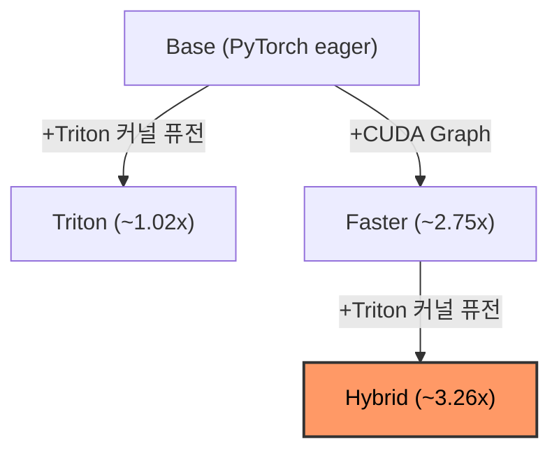

# omnivoice-triton

[](https://github.com/newgrit1004/omnivoice-triton/actions/workflows/ci.yml)
[](https://pypi.org/project/omnivoice-triton/)
[](https://pypi.org/project/omnivoice-triton/)
[](https://opensource.org/licenses/Apache-2.0)

**Triton 커널 퓨전 + CUDA Graph 최적화로 [OmniVoice](https://github.com/k2-fsa/OmniVoice) TTS 추론 최대 3.26배 가속.**

[English](README.md) | [벤치마크 결과](docs/benchmark_results_ko.md)

> [!NOTE]
> 이 프로젝트는 **RTX 5090 (Blackwell, sm_120)** + **WSL2** (CUDA 12.8, PyTorch 2.8) 환경에서만 테스트되었습니다.
> Triton 커널은 아키텍처 독립적으로 작성되어 (sm_120 전용 코드 없음) 다른 NVIDIA GPU (A100, H100, RTX 4090 등)에서도 동작할 것으로 예상되지만, **검증되지 않았습니다**. 다른 GPU에서 테스트하셨다면 이슈 또는 PR로 결과를 공유해 주세요!

---

## 왜 이 프로젝트인가

OmniVoice는 **비자기회귀(NAR) 반복 언마스킹(iterative unmasking)** 아키텍처를 사용합니다: 32번의 순전파(forward pass)를 통해 전체 토큰 시퀀스를 생성하며, 각 패스는 Qwen3-0.6B 백본의 28개 레이어 전체를 통과합니다. 시퀀스가 토큰 단위로 늘어나는 자기회귀(AR) TTS와 달리, OmniVoice는 시퀀스 길이를 **고정**한 채 (지속 시간 추정기가 결정) 모든 위치를 병렬로 점진적으로 개선합니다.

이 구조에서 일반 AR 모델에는 없는 두 가지 최적화 기회가 생깁니다:

1. **CUDA Graph**: 32번의 언마스킹 스텝 전체에서 시퀀스 길이가 고정되므로, 모든 순전파가 **동일한 텐서 형태**를 갖습니다. CUDA Graph는 28개 레이어 순전파 전체를 한 번 캡처하고 재생할 수 있어 — 발화당 약 900번의 커널 실행 오버헤드를 제거합니다.

2. **Triton 커널 퓨전**: Qwen3-0.6B 백본은 RMSNorm과 SwiGLU 활성화를 사용합니다. 이 연산들은 메모리 대역폭 제한(memory-bandwidth-bound)이므로, 퓨전을 통해 HBM 왕복 횟수를 4→1로 줄이고 (RMSNorm), 중간 텐서를 제거합니다 (SwiGLU).

두 기법을 결합한 **Hybrid** 모드 — CUDA Graph 캡처 전에 Triton 커널을 적용 — 는 추가 VRAM 50MB만으로 E2E 3.26배 속도 향상을 달성합니다.

---

## 벤치마크 결과

**하드웨어**: RTX 5090, CUDA 12.8, PyTorch 2.8, Python 3.12

| Runner | 한국어 | 영어 | 중국어 | 평균 속도 향상 | 최대 VRAM |
|--------|:------:|:----:|:------:|:-------------:|:---------:|
| Base | 556ms | 781ms | 573ms | 1.00x | 1.95 GB |
| Triton | 519ms | 512ms | 506ms | **1.02x** | 1.95 GB |
| Faster | 193ms | 227ms | 188ms | **2.75x** | 1.98 GB |
| **Hybrid** | **165ms** | **179ms** | **164ms** | **3.26x** | 2.00 GB |

**RTF (Real-Time Factor)**: Hybrid 모드는 언어 전반에 걸쳐 14–20배 실시간 성능을 달성합니다 (RTF = 오디오 길이 / 생성 시간; 높을수록 빠름).

| Runner | RTF (한국어) | RTF (영어) | RTF (중국어) |
|--------|:-----------:|:---------:|:-----------:|
| Base | 4.7x | 4.6x | 3.5x |
| Triton | 5.0x | 6.5x | 4.0x |
| Faster | 14.6x | 16.0x | 11.7x |
| **Hybrid** | **16.6x** | **20.4x** | **13.8x** |

> 벤치마크는 워밍업 3회 + 측정 5회로 실행됩니다. 전체 데이터는 [docs/benchmark_results_ko.md](docs/benchmark_results_ko.md)를 참조하세요.

### 커널 마이크로벤치마크

> RTX 5090, bf16, batch=1, seq_len=512, hidden=1024. `make bench-kernels`로 재현 가능.

| 커널 | PyTorch (ms) | Triton (ms) | 속도 향상 | HBM 절감 |
|------|:------------:|:-----------:|:---------:|:--------:|
| RMSNorm | 0.027 | 0.005 | **5.90x** | 4→1 왕복 |
| SwiGLU | 0.010 | 0.007 | **1.43x** | 3→1 왕복 |
| Fused Add+RMSNorm | 0.029 | 0.006 | **4.47x** | 2 커널 → 1 |

---

## 4가지 추론 모드

| 모드 | 최적화 | 적합한 용도 |
|------|--------|------------|
| **Base** | 없음 (PyTorch eager) | 기준선 비교, 디버깅 |
| **Triton** | 커널 퓨전 (RMSNorm, SwiGLU, FusedNorm) | 최소 오버헤드, 최대 호환성 |
| **Faster** | CUDA Graph 캡처 & 재생 | 저지연 서빙 |
| **Hybrid** | Triton + CUDA Graph | 최대 처리량 (권장) |



---

## 빠른 시작

### 설치

```bash
# 1. CUDA 12.8 지원 PyTorch 설치
pip install torch torchaudio --index-url https://download.pytorch.org/whl/cu128

# 2. 소스에서 설치
git clone https://github.com/newgrit1004/omnivoice-triton
cd omnivoice-triton
uv sync
```

> **UV는 가상환경을 자동으로 관리합니다** — 수동으로 venv를 활성화할 필요가 없습니다.
> 모든 명령어는 `uv run` 접두사를 사용합니다 (예: `uv run pytest`, `uv run python script.py`).

> [!TIP]
> 첫 실행 시 OmniVoice 모델 (~2GB)이 HuggingFace에서 자동으로 다운로드됩니다.

### 기본 사용법

```python
from omnivoice_triton import create_runner
import soundfile as sf

# Hybrid 모드: Triton 커널 퓨전 + CUDA Graph (3.26배 빠름)
runner = create_runner("hybrid")
runner.load_model()

# 음성 합성
result = runner.generate(text="안녕하세요, 오늘 날씨가 정말 좋네요.")
sf.write("output.wav", result["audio"], result["sample_rate"])
print(f"생성 시간: {result['time_ms']:.1f}ms, VRAM: {result['peak_vram_gb']:.2f}GB")

runner.unload_model()
```

### 4가지 모드 전체

```python
from omnivoice_triton import create_runner

# 표준 PyTorch (기준선)
runner = create_runner("base")

# Triton 커널 퓨전만
runner = create_runner("triton")

# CUDA Graph만
runner = create_runner("faster")

# Triton + CUDA Graph (권장)
runner = create_runner("hybrid")
```

---

## 음성 클로닝 & 음성 디자인

OmniVoice는 세 가지 생성 모드를 지원합니다. 모든 모드는 4가지 러너 전체에서 사용 가능합니다.

### 표준 TTS

```python
result = runner.generate(text="표준 텍스트-음성 변환입니다.")
audio = result["audio"]  # numpy 배열, 24kHz
```

### 음성 클로닝

참조 오디오 파일에서 화자 정체성을 복제합니다. 오디오와 해당 전사본을 제공합니다.

```python
result = runner.generate_voice_clone(
    text="이것은 클로닝된 음성입니다.",
    ref_audio="reference.wav",          # 길이 무관, 16kHz 이상 권장
    ref_text="참조 오디오의 전사본.",
)
```

### 음성 디자인

자연어 설명으로 음성을 생성합니다 — 참조 오디오 불필요. OmniVoice만의 독자적인 인스트럭트 기반 음성 생성 기능입니다.

```python
result = runner.generate_voice_design(
    text="디자인된 음성 출력입니다.",
    instruct="여성, 젊은 성인, 높은 음조, 따뜻한 톤",
)
```

음성 디자인은 성별, 나이, 음조, 말하는 스타일, 감정, 억양 등을 자유롭게 기술하는 텍스트를 받습니다.

---

## 동작 원리

### Triton 커널 퓨전

Qwen3-0.6B LLM 백본에는 현대 GPU에서 메모리 대역폭 제한인 RMSNorm과 SwiGLU 연산이 포함됩니다. 각 연산은 HBM(고대역폭 메모리)에서 텐서를 읽고 씁니다; 여러 연산을 단일 커널로 퓨전하면 이 왕복 횟수가 줄어듭니다:

| 커널 | 퓨전 대상 | HBM 절감 | 파일 |
|------|----------|----------|------|
| **RMSNorm** | variance + normalize + scale을 SRAM에서 처리 | 4→1 왕복 | `kernels/rms_norm.py` |
| **SwiGLU** | `silu(gate) * up` — 중간 텐서 제거 | 3→1 왕복 | `kernels/swiglu.py` |
| **Fused Add+RMSNorm** | `residual + x` 후 RMSNorm을 단일 패스로 | 2 커널 → 1 | `kernels/fused_norm_residual.py` |

`apply_triton_kernels()`은 로드된 모델에 in-place monkey-patching을 수행합니다 — 가중치 복사 없음, 모델 재구성 없음:

1. **RMSNorm 모듈** → `TritonRMSNorm`으로 교체 (원본 가중치 공유, 제로 카피)
2. **MLP forward** → `triton_swiglu_forward` 사용으로 패치 (gate+up 프로젝션 퓨전)
3. **Decoder layer forward** → residual 덧셈 + 정규화 퓨전으로 패치

```python
from omnivoice_triton.models.patching import apply_triton_kernels

# 28개 디코더 레이어를 모두 in-place 패치
apply_triton_kernels(model)
```

### CUDA Graph 최적화

OmniVoice는 28개 레이어 LLM을 통해 반복 언마스킹(32 스텝)을 사용합니다. 각 스텝은 **동일한 텐서 형태**를 가집니다 (시퀀스 길이가 지속 시간 추정기에 의해 고정됨). CUDA Graph는 전체 순전파를 한 번 캡처하고 재생하여 발화당 약 900번의 커널 실행 오버헤드를 제거합니다.

| 측면 | 자기회귀 TTS | NAR (omnivoice-triton) |
|------|:-:|:-:|
| 그래프 대상 | 1-토큰 디코딩 스텝 | 전체 시퀀스 순전파 |
| 정적 KV 캐시 | 필요 | 불필요 |
| 발화당 반복 횟수 | ~수백 회 (가변) | 32회 (고정) |
| 캐시 형태 키 | 항상 `[1, 1]` | seq_len별 |

핵심 인사이트: NAR의 고정 시퀀스 길이 덕분에 CUDA Graph 적용이 AR 모델보다 **더 단순**합니다 — 관리할 정적 KV 캐시가 없으며, 그래프 형태는 지속 시간 추정기 출력만으로 결정됩니다.

---

## 3-Tier 검증 체계

[Liger Kernel](https://github.com/linkedin/Liger-Kernel)에서 영감을 받아 반복 언마스킹 TTS에 맞게 적용.

| Tier | 검증 대상 | 방법 | 소요 시간 | 명령어 |
|------|----------|------|----------|--------|
| **Tier 1: 커널** | 각 커널의 수치 정확도 | PyTorch 참조 대비 atol/rtol | ~5초 | `make test` (60개 테스트) |
| **Tier 2: 모델** | 28-레이어 모델 출력 보존 | 레이어별 코사인 유사도 | ~15초, GPU | `make test-parity` |
| **Tier 3: E2E** | E2E 생성 품질 | temperature=0 근사 결정론적 쌍 비교 | ~5분, GPU | `make smoke-test` |

### Tier 1 임계값

| dtype | atol | rtol |
|-------|------|------|
| float32 | 1e-5 | 1e-5 |
| float16 | 1e-3 | 1e-3 |
| bfloat16 | 5e-2 | 5e-2 |

### Tier 2: 최신 결과

OmniVoice는 temperature=0에서 근사 결정론적입니다 — 동일한 입력이 동일한 출력을 생성하므로 Tier 2에서 직접 쌍별 비교가 유효합니다.

| 레이어 | 코사인 유사도 |
|--------|-------------|
| L0 | > 0.999 |
| L7 | > 0.999 |
| L14 | > 0.998 |
| L21 | > 0.997 |
| L27 | > 0.995 |

> FP 누적 오차로 인해 28개 레이어를 거치면서 유사도가 자연스럽게 감소합니다 — 연산 순서를 변경하는 퓨전 커널의 예상된 동작입니다.

```bash
make test          # Tier 1: 커널 정확도 (60개 테스트)
make test-parity   # Tier 2: 모델 패리티 (GPU 필요)
make verify        # Tier 1 + 2
make smoke-test    # Tier 3: 빠른 E2E 검사
```

---

## 아키텍처

```
OmniVoice (k2-fsa/OmniVoice)
├── LLM 백본: Qwen3-0.6B (28개 레이어)
│   ├── Hidden: 1024, Heads: 16, KV Heads: 8
│   ├── Head dim: 128, Intermediate: 3072
│   ├── Activation: SwiGLU, Norm: RMSNorm
│   └── Position: Standard RoPE
├── 오디오: 8 코드북 × 1025 어휘
└── 생성: Diffusion 기반 NAR (반복 언마스킹, 32 스텝)
```

### LLM 백본 파라미터

| 파라미터 | 값 |
|----------|-----|
| 모델 | Qwen3-0.6B |
| Hidden Size | 1024 |
| Attention Heads | 16 (GQA, kv\_heads=8) |
| Head Dim | 128 |
| Intermediate Size | 3072 |
| Layers | 28 |
| RMS Norm Eps | 1e-6 |
| 위치 인코딩 | Standard RoPE |
| 활성화 함수 | SwiGLU |

---

## Streamlit 대시보드

```bash
make ui  # http://localhost:8501
```

대시보드 기능:
- 4가지 모드 나란히 추론 비교
- 실시간 메트릭 (생성 시간, RTF, 최대 VRAM)
- 시각적 비교를 위한 Plotly 차트
- 3-Tier 검증 결과 카드

---

## 프로젝트 구조

```
omnivoice-triton/
├── src/omnivoice_triton/
│   ├── __init__.py               # 공개 API + __version__
│   ├── py.typed                  # PEP 561 타입 마커
│   ├── kernels/                  # 3개 Triton GPU 커널
│   │   ├── rms_norm.py           # Fused RMSNorm
│   │   ├── swiglu.py             # Fused SwiGLU
│   │   └── fused_norm_residual.py # Fused Add+RMSNorm
│   └── models/                   # 4가지 러너 클래스 + 패칭
│       ├── patching.py           # Monkey-patch 로직
│       ├── base_runner.py        # 표준 PyTorch
│       ├── triton_runner.py      # Triton 최적화
│       ├── faster_runner.py      # CUDA Graph 래퍼
│       └── triton_faster_runner.py # Hybrid (Triton + CUDA Graph)
├── tests/
│   ├── kernels/                  # Tier 1: 커널 정확도
│   │   ├── test_rms_norm.py
│   │   ├── test_swiglu.py
│   │   └── test_fused_norm.py
│   └── test_model_parity.py      # Tier 2: 모델 패리티
├── benchmark/                    # E2E + 커널 + 음성 클로닝 벤치마크
│   ├── bench_e2e.py
│   ├── bench_kernels.py
│   ├── bench_voice_clone.py
│   └── results/                  # JSON 벤치마크 출력
├── docs/                         # 문서
│   ├── benchmark_results_en.md
│   └── benchmark_results_ko.md
├── scripts/                      # 샘플 생성 유틸리티
├── pyproject.toml                # UV + hatchling 설정
└── uv.lock                       # 잠긴 의존성
```

---

## 요구사항

- Python >= 3.12
- NVIDIA GPU (CUDA 12.8+)
- PyTorch >= 2.8
- ~2 GB VRAM
- WSL2 (Windows Subsystem for Linux 2) 환경에서 테스트됨

---

## 인용

이 프로젝트를 연구에 사용하신다면 다음과 같이 인용해 주세요:

```bibtex
@software{omnivoice_triton,
  author    = {newgrit1004},
  title     = {omnivoice-triton: Triton Kernel Fusion and CUDA Graph Optimization for OmniVoice TTS},
  year      = {2025},
  url       = {https://github.com/newgrit1004/omnivoice-triton},
  license   = {Apache-2.0}
}
```

---

## 감사의 말

- [OmniVoice](https://github.com/k2-fsa/OmniVoice) — 기반 TTS 모델 (k2-fsa)
- [Liger Kernel](https://github.com/linkedin/Liger-Kernel) — Triton 커널 설계 패턴 및 3-Tier 검증 방법론
- [Triton](https://github.com/triton-lang/triton) — GPU 커널 컴파일러

---

## 라이선스

Apache-2.0
